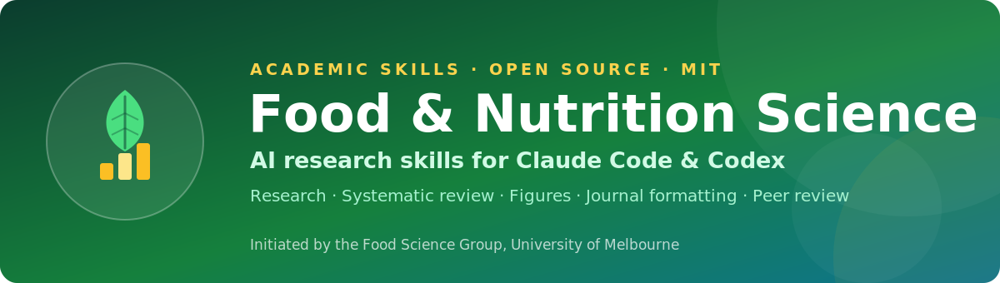

<p align="center">
  
</p>

# Academic Skills for Food & Nutrition Science

[](https://doi.org/10.5281/zenodo.21372994)
[](LICENSE)

> **AI research assistant for food, nutrition and agricultural science** — Claude
> Code, Codex, MiniMax Agent, and OpenClaw skills for **literature
> review, systematic review (PRISMA & meta-analysis), data analysis and
> statistics, scientific figures, journal formatting, and peer review**.
> Food, nutrition & agriculture research automation, end to end.

Original, **MIT-licensed** skills for the food, nutrition & agriculture research
lifecycle — **research → write → review → revise → finalize** — where each core skill
is a **multi-subagent system** and a master pipeline orchestrates them, with built-in
knowledge of food, nutrition & agriculture journal author guidelines and a scientific
figure workflow. Two parallel skill sets share one engine: **`food-*`** for food &
nutrition science and **`agri-*`** for agricultural science. Supports Claude Code,
Codex, MiniMax Agent, and OpenClaw.

This open project was **initiated by the Food Science Group at the University of
Melbourne**, and we warmly welcome food & nutrition research groups from around
the world to use, adapt, and contribute to it. MIT-licensed and open source.

## Install

**Claude Code** (one command):

```bash
claude plugin marketplace add PangenomeAI/academic-skills-food-nutrition && \
claude plugin install academic-skills-food-nutrition@academic-skills-food-nutrition
```

Then restart Claude Code (or run `/plugin`). Update later with
`claude plugin update academic-skills-food-nutrition`.

**Claude Code, Codex, and MiniMax Agent** (one command via the installer):

```bash
curl -fsSL https://raw.githubusercontent.com/PangenomeAI/academic-skills-food-nutrition/main/install.sh | bash
```

Or, from a local clone: `./install.sh` (all) · `./install.sh claude` · `./install.sh codex` · `./install.sh minimax` · `./install.sh openclaw`.
The installer registers the Claude Code plugin, and for **Codex**
(`${CODEX_HOME:-~/.codex}/skills/`), **[MiniMax Agent](https://agent.minimax.io/)**
(Mavis; `${MAVIS_SKILLS_DIR:-~/.mavis/skills}/`),
**[OpenClaw](https://openclaw.ai)** (`${OPENCLAW_HOME:-~/.openclaw}/skills/`) it installs **each skill flat**
(`…/skills/<name>/SKILL.md`, so the agent discovers it) **plus** the shared
`journals/` and `scripts/` directories so cross-skill references resolve. Restart
the app so it rescans skills. (Override the location with `CODEX_HOME` /
`MAVIS_SKILLS_DIR` / `OPENCLAW_HOME`, or add via MiniMax's
in-app Skill Creator/import.)

## Updating

**Updates are not automatic** — once installed you stay on that version until you
choose to update. To get the latest release:

**Claude Code** (built-in update):
```bash
claude plugin update academic-skills-food-nutrition
```
Restart Claude Code (or run `/plugin`) to apply. If it doesn't yet show the newest
version, refresh the marketplace first:
```bash
claude plugin marketplace update academic-skills-food-nutrition
```

**Codex / MiniMax Agent (Mavis) / OpenClaw** — re-run the installer
(it cleanly replaces the skills), then restart the app:
```bash
curl -fsSL https://raw.githubusercontent.com/PangenomeAI/academic-skills-food-nutrition/main/install.sh | bash
# or, from a local clone:  ./install.sh codex  |  ./install.sh minimax  |  ./install.sh openclaw
```

Check your installed version with `claude plugin list`; see all versions on the
[Releases](https://github.com/PangenomeAI/academic-skills-food-nutrition/releases)
page (a GitHub Release is published automatically on each feature update).

## Skills

### Core workflow
- **`food-research`** — comprehensive, multi-source literature discovery and
  evidence synthesis for food & nutrition (FSTA, PubMed, Web of Science, Scopus,
  AGRICOLA, preprints, semantic search; EFSA/FDA/USDA/Codex for safety and
  regulatory evidence). Four-layer search, two-phase screening, and synthesis via
  subagents; grades evidence and maps gaps. Four streams — **quick brief, full
  review, deep research, systematic**. The first three **prioritize sources by
  journal ranking** (`journal_ranker`: Q1/Q2 food-science & nutrition, plus
  Nature/Science/Cell families and Q1/Q2 in any other discipline = highest
  priority; Q3 second; Q4 avoided). The **full review** and **systematic** streams
  finish by writing a manuscript, running an editorial + integrity `reviewer`
  loop, and exporting a **Word (.docx)** (APA 7.0 default, or a target journal via
  `journal-selector`). The **PRISMA 2020 systematic review** stream adds a fixed
  protocol, ≥3 databases (Web of Science/Scopus/PubMed), **dual independent
  three-step screening** (title → abstract → full text) with a moderator, a PRISMA
  flow diagram, a results table, and **OHAT risk-of-bias** (in vitro / human /
  animal); it uses eligibility-based inclusion rather than journal ranking.
- **`food-deep-research`** — source-validated literature-review engine (scope → design
  → discover → **screen by journal ranking** → **validate every source** →
  extract & verify evidence → synthesize → stress-test → **write & format** →
  editorial + integrity review loop) with a 12-subagent team. Outputs a finished,
  formatted review (**APA 7.0** by default, or a target journal's style via
  `journal-selector`). Runs standalone or as `food-research`'s deep-dive engine.
- **`food-paper`** — whole-process manuscript system (12 subagents) covering the
  full research lifecycle: understand the field (calls `food-research`), frame
  research questions, **curate data**, run **statistics**, build **figures &
  tables** (calls `food-figure`), construct arguments and discussion, draft,
  **polish**, manage citations, and **self-review** (calls `food-review`) —
  journal-aware throughout (APA 7.0 default, or a target journal via
  `journal-selector`).

  **8 modes** — you rarely need the whole pipeline; the two most-used are
  **`polish`** and **`format-convert`**. See [food-paper modes](#food-paper-modes-what-each-one-does).
- **`food-review`** — multi-reviewer peer-review panel (coordinating editor +
  methodology, domain/novelty, and integrity/ethics reviewers + a devil's
  advocate) with a **formatting-compliance check** against the target journal
  (APA 7.0 default, or a specific journal via `journal-selector`), ending in an
  editorial decision + revision checklist + response-letter skeleton.
- **`food-fetch`** — **lawful full-text acquisition** (6 subagents) so the research
  and review skills read **papers, not abstracts**. Routes each article through legal
  **open access** (Unpaywall/OpenAlex/PMC/arXiv — always downloaded via
  [`scripts/fetch_oa.py`](scripts/fetch_oa.py)), the user's **own reference-manager
  library** (EndNote/Zotero/Mendeley PDFs, read-only), and — only with the user's
  **own logged-in institutional browser session** — their library's **entitled** full
  text; then writes a coverage **manifest** of what was and wasn't obtained. **Never
  bypasses paywalls, DRM, logins, or 2FA**, and never summarizes a paper it didn't
  read. Called by `food-research`, `food-deep-research`, and `food-review`.
- **`food-pipeline`** — **master orchestrator** that routes a project to the
  specialist skills (each with its own subagent team) and enforces quality gates:
  journal selection → research (`food-research`/`food-deep-research`) → write & analyze
  (`food-paper` → `food-figure`) → peer review (`food-review`) → revise →
  finalize, with mandatory author decision points. **Default: one** review→revise
  round; a second round and in-place Tracked Changes on the original Word file
  require **explicit author authorization** (avoids over-automation).

### `food-paper` modes: what each one does
`food-paper` is eight tools in one, and **you rarely need the whole pipeline**. You
never type a mode name: ask in plain English and the right mode is selected.
`agri-paper` has the **same eight modes** for agricultural manuscripts.

| Mode | What it does | Say something like… |
|---|---|---|
| ⭐ **polish** | Language editing to publication-quality English **plus removal of AI writing tells** (details below). Doesn't touch your science. | *"polish my manuscript"* · *"improve the English in my discussion"* · *"make this read like a scientist wrote it"* |
| ⭐ **format-convert** | Reformats a **finished** paper for another journal: structure, word/abstract limits, headings, and the **whole reference list** re-flowed to the new style. Exports **DOCX, LaTeX (.tex), or Markdown** and builds a **PDF**. Preserves EndNote/Zotero fields. **No re-research, no re-review, no rewriting.** | *"reformat my manuscript for Food Chemistry"* · *"convert to LWT style"* · *"my paper is finished, I just need the formatting"* |
| **full** *(default)* | The whole lifecycle: field → questions → data/stats → figures → argument → draft → polish → self-review. | *"write my paper from this dataset"* |
| **revise** | Revises against reviewer comments with **Tracked Changes** and answers each point. | *"address these reviewer comments"* |
| **section** | Drafts or rewrites **one** section only. | *"rewrite my introduction"* · *"draft the methods"* |
| **outline** | Detailed outline + evidence map, no prose. | *"outline my paper"* |
| **plan** | Socratic chapter-by-chapter planning, no draft. | *"help me plan this paper"* |
| **stats** | Statistical analysis plan / execution guidance only. | *"which test should I use for this design?"* |

⭐ = the two most-used. Both work on a manuscript you **already have**, and neither
rewrites your science.

#### What `polish` actually does
Beyond grammar and clarity, its `polisher` subagent runs
[`human-writing.md`](food-paper/references/human-writing.md) to strip the tells that
make text read as machine-generated:

- inflated significance ("plays a pivotal role", "paves the way")
- vague attribution ("studies have shown" → **a real citation**)
- stock AI vocabulary ("delve", "intricate landscape", "showcase")
- copula avoidance ("serves as" → "is"), filler, **stacked** hedging
- generic upbeat endings ("opens exciting avenues")

…then asks *"what still reads as machine-written?"* and fixes what it finds.

It deliberately **keeps** calibrated hedging (deleting a "may" your data require
would be a fabrication-grade error, not a polish), passive voice in Methods, and the
journal's required heading style — and it never changes a number, a claim's scope, or
a citation. This is a **writing-quality edit, not a way to hide AI use**: the
[AI-use disclosure](#using-ai-responsibly-for-academic-work) requirement stands
regardless of how the prose reads.

### Agricultural science (`agri-*`)
The same five-skill workflow for **agricultural science**, acting as a **senior
agricultural scientist of the relevant discipline** — agronomy · soil science ·
horticulture · dairy & animal science · agricultural engineering · agricultural
economics & policy · agriculture multidisciplinary.

- **`agri-research`** · **`agri-deep-research`** · **`agri-paper`** ·
  **`agri-review`** · **`agri-pipeline`** — each **delegates its machinery to the
  corresponding `food-*` skill** (same subagents, gates, modes, and output
  contracts) and applies three substitutions: the **persona**, the **evidence base**,
  and **journal routing**. One engine, no duplicated architecture. Figures still go
  through `food-figure`, which is domain-neutral.
- **Evidence base:** agriculture + multidisciplinary literature, ranked like the food
  suite — **Tier 1** the **230 Q1/Q2 agriculture journals** plus the
  Nature/Science/Cell/PNAS families and Q1/Q2 adjacent disciplines; **Tier 2** Q3 for
  gaps only; **Q4 avoided**. FAO, USDA, CGIAR, EFSA and extension sources count as
  evidence with a source and date.
- **Agricultural rigour:** field-trial reporting (site, season/years, soil, cultivar,
  design, replication), **the experimental unit** (pseudoreplication is the classic
  fatal flaw), G×E and season-to-season variation, ARRIVE for animal work, soil
  sampling depth and equivalent-soil-mass basis, and no pot-to-field extrapolation.
  The contract: [`agri-research/references/agriculture-domain.md`](agri-research/references/agriculture-domain.md).

### Journal knowledge
- **`journal-selector`** *(shared machinery — deliberately **not** in the skill
  list)* — asks which journal you're targeting (or reads it from
  your request) and loads that journal's constraints. You never invoke it directly:
  just name a journal to any skill above and it runs. Covers the **Food Science &
  Technology** (60) and **Nutrition & Dietetics** (59) journal lists, the **230 Q1/Q2
  agriculture** journals across seven JCR categories, plus **35
  multidisciplinary / cross-discipline** journals these researchers
  publish in (Nature, Science, Cell, and PNAS families, eLife, PLOS, ES&T, Gut,
  etc.). See [`journals/_coverage.md`](journals/_coverage.md),
  [`journals/_coverage_nutrition.md`](journals/_coverage_nutrition.md),
  [`journals/_coverage_agriculture.md`](journals/_coverage_agriculture.md), and
  [`journals/_coverage_multidisciplinary.md`](journals/_coverage_multidisciplinary.md).
- **`journals/*`** — 25 publisher-tiered author-guideline skills covering the
  **Food Science & Technology**, **Nutrition & Dietetics**, **agriculture (Q1/Q2)**,
  and multidisciplinary journal lists
  (Elsevier, Wiley, Nature Portfolio, Springer, Taylor & Francis, MDPI, RSC, ACS,
  Annual Reviews, Oxford, Emerald, KeAi/Tsinghua, Codon, BioMed Central,
  Cambridge, Frontiers, plus niche-publisher skills for nutrition and agriculture).
  Because the folders are **publisher-tiered**, an Elsevier agronomy journal reuses
  the same Guide-for-Authors skill as an Elsevier food journal — **185 of the 230
  agriculture journals need no new format**. Each lists the journals it
  covers, their limits, structure, **reference/citation style**, and a submission
  checklist.

### Figures
- **`food-figure`** — comprehensive figure system: **analyzes your data**
  (`scripts/analyze_data.py` profiles a CSV/TSV and **recommends the best figure
  type**), then renders submission-grade graphics in **Python or R** at the target
  journal's spec. Covers all common scientific figure types (bar/box/violin,
  line/kinetic, scatter/regression, Bland-Altman, sensory radar, chromatograms,
  TPA/rheology, dose-response, survival, PCA/PLS-DA, clustered heatmaps, forest,
  microscopy plates, multi-panel), with Python (matplotlib/seaborn/subplot_mosaic/
  statsmodels) and R (ggplot2/patchwork/ComplexHeatmap/ggrepel + svglite/cairo_pdf/
  ragg) template libraries, curated colourblind-safe palettes, per-figure
  provenance + captions, and a QA gate. Exports journal-ready SVG/PDF/TIFF. For
  **schematics/graphical abstracts**, an opt-in AI-image route (Gemini/ChatGPT/
  Claude) with a structured prompt method — never for data figures. A runnable
  **synthetic/illustrative Figure-story gallery** provides four final 11- or
  12-panel food-science figures spanning active packaging, probiotic storage,
  trained sensory analysis, and analytical-method validation. Each narrative
  progresses from a code-drawn experimental schematic through topic-specific raw
  and derived evidence to an explicitly illustrative synthesis panel, with
  deterministic source-data generation, PDF + PNG exports, captions, and trace
  cards. The gallery also documents an AI schematic-route test and its
  QA/reproducibility safeguards.

## How it fits together

Name a journal ("I want to publish on Food Chemistry" / "format for LWT") and
`journal-selector` loads that journal's rules; `food-paper` writes to them and
re-flows the reference list into the journal's citation style; any figure
request goes to `food-figure` at the journal's DPI and column width. Ask for the
whole thing and `food-pipeline` runs research → write → review → revise with
checkpoints.

### Which one do I pick?
Use the smallest skill that does the job — the pipeline is for whole projects, not
one-off tasks.

| You have… | You want… | Use |
|---|---|---|
| A topic or question | The evidence | `food-research` (or `agri-research`) |
| A dataset / results | A manuscript | `food-paper` (or `agri-paper`) |
| A finished draft | A critique before submitting | `food-review` (or `agri-review`) |
| Reviewer comments + your draft | The revision + responses | `food-paper` **revise** |
| **A finished, reviewed, polished paper** | **Only to change it to another journal's format** | **`food-paper` `format-convert`** — say *"reformat my manuscript for Food Chemistry"*. It re-flows structure, word/abstract limits, headings and the **whole reference list** into the new style, exports `.docx`/LaTeX/PDF, and **preserves EndNote/Zotero citation fields** — **no re-research, no re-review, no rewriting of your science.** |
| A topic and nothing else, and you want it all | The whole project managed | `food-pipeline` (or `agri-pipeline`) |

Reformatting is deliberately **not** a pipeline job: running the pipeline on a
finished paper would re-research, re-review, and re-edit work you already consider
final.

## Coverage

Every target journal maps to a publisher-tiered skill, verified by
[`scripts/check_journal_coverage.py`](scripts/check_journal_coverage.py):

| List | Journals | Map |
|---|---|---|
| Food Science & Technology | 60 | [`_coverage.md`](journals/_coverage.md) |
| Nutrition & Dietetics | 59 | [`_coverage_nutrition.md`](journals/_coverage_nutrition.md) |
| **Agriculture (Q1 + Q2)** | **230** (109 Q1, 121 Q2) | [`_coverage_agriculture.md`](journals/_coverage_agriculture.md) |
| Multidisciplinary | 35 | [`_coverage_multidisciplinary.md`](journals/_coverage_multidisciplinary.md) |

The agriculture list is the **Q1 and Q2** journals of all seven JCR agriculture
categories (Agronomy · Agriculture Multidisciplinary · Dairy & Animal Science · Soil
Science · Agricultural Economics & Policy · Horticulture · Agricultural Engineering),
from JCR 2025, **deduplicated** across categories at each journal's best quartile.
Q3 fills gaps only and **Q4 is avoided**. Journals already in the food or nutrition
lists keep their existing folder (Journal of Dairy Science → `j-dairy-science`), and
185 of the 230 reuse an existing publisher format — only society and regional titles
fall to `agri-other`.

Author-guideline details record a `Source:` URL and a `Verified:` date. Publisher
pages change and several block automated access — confirm exact numeric limits at
the source before submitting; structure and reference styles are the stable part.

## Limitations

**The tool is only as informed as the literature it can actually read.** Because it
never fabricates, its knowledge base — and therefore the depth of a review or the
strength of a claim's grounding — is bounded by what it can legitimately access:

- **Metadata, abstracts, and open-access full text** work with no setup (Crossref,
  OpenAlex, Unpaywall, PubMed/Europe PMC; [`resolve_oa.py`](scripts/resolve_oa.py)).
  Roughly half of the literature has a legal free copy.
- **Paywalled articles have no free full text.** The tool **will not bypass
  paywalls**. Without a copy you provide, a paywalled source is read at
  **abstract-level only and flagged as unverified** — it is never summarized as if the
  full paper had been read. For load-bearing citations, `knowledge_builder` asks you
  to supply access rather than guess.
- **You can lift this limit** — in rough order of coverage:
  1. **Point the tool at your reference-manager library** (EndNote `.Data/PDF/`,
     Zotero `storage/`, Mendeley) — it reads the PDFs you have **already downloaded**,
     giving the fullest picture of a paper's own reference list. Works in Claude Code
     and Cowork; libraries synced via OneDrive/Dropbox are fine.
  2. **Drop the specific cited PDFs** into the project folder.
  3. **Connect a literature MCP/connector** (PubMed full-text, Europe PMC, a
     publisher/library connector).
  4. **Use a logged-in institutional browser session** (library proxy / VPN).

See [`full-text-access.md`](food-research/references/full-text-access.md) for the full
retrieval policy. Other standing limits: the model has **no live database of its
own** (all literature comes through tools); publisher pages change, so **confirm exact
journal limits at the source**; and every AI-generated claim, number, and citation is
**your responsibility to verify** (see below).

## Using AI responsibly for academic work

> **AI can make mistakes.** Large language models can produce fluent but incorrect
> statements, invented references, and unsupported conclusions. **You — the
> researcher — are responsible for the integrity of your work.**

These skills are research **assistants, not authors**. Treat every AI-generated
statement as a *draft to be verified*, never as established fact.

### Your responsibilities
- **Validate everything.** Check every claim, number, and citation against the
  primary source before you use or submit it. This project enforces an
  anti-fabrication grounding rule and ships a runnable check
  ([`scripts/verify_citations.py`](scripts/verify_citations.py); see
  [`faithfulness-and-citation.md`](food-paper/references/faithfulness-and-citation.md)) —
  use them, but they do **not** replace your own judgement.
- **Never present unverified AI output** as your own knowledge or as fact; do not
  submit AI-written text you have not checked and understood.
- **Disclose your use of AI** honestly, following your venue's and institution's
  policy — most journals and universities now require an AI-use statement
  (see [`declarations-guide.md`](food-paper/references/declarations-guide.md)).
- **Follow your institution's academic-integrity rules.**

### Writing that reads like a scientist — and why that isn't a loophole
The writing skills actively remove **AI writing tells**: inflated significance
("plays a pivotal role", "paves the way"), vague attribution ("studies have shown"),
stock vocabulary ("delve", "intricate landscape", "showcase"), "serves as" instead of
"is", hedge stacking, and generic upbeat endings. These are **bad scientific
writing** in their own right — vague, unattributed, and overstated — so cutting them
makes a manuscript clearer, more specific, and more honest. See
[`human-writing.md`](food-paper/references/human-writing.md).

> **This is a quality edit, not a disguise.** It is **not** a way to hide AI
> involvement, defeat an AI detector, or evade a journal's or university's AI
> policy. **The AI-use disclosure requirement stands regardless of how the prose
> reads** — the suite still writes that disclosure into every manuscript it drafts.
> The guide also refuses to trade accuracy for style: it keeps **calibrated
> hedging** (removing a "may" that the data require is a fabrication-grade error,
> not a polish), keeps passive voice where Methods need it, defers to the journal's
> house style, and never lets an edit change a value, a claim's scope, or a citation.

### University of Melbourne policy (for UoM staff and students)
This project is initiated by the Food Science Research Team at the University of Melbourne; UoM users must comply with University policy on acknowledging and using generative AI. Always check the
current policy and your course/coordinator's specific requirements:
- [Acknowledging use of AI tools and technologies](https://students.unimelb.edu.au/academic-skills/academic-integrity/acknowledging-use-of-ai-tools-and-technologies)
- [Academic integrity](https://students.unimelb.edu.au/academic-skills/academic-integrity)
- [Using AI as a graduate researcher (graduate researchers and digital assistance tools)](https://gradresearch.unimelb.edu.au/preparing-my-thesis/graduate-researchers-and-digital-assistance-tools)
- [Guidelines for allowing student GenAI use in assessment](https://www.unimelb.edu.au/tli/lda/genai-hub/resources-links/guidelines-for-allowing-student-genai-use-in-assessment)
- [Writing with GenAI](https://students.unimelb.edu.au/academic-skills/study-skills/learning-with-genai/writing-with-genai)
- [Studying with GenAI](https://students.unimelb.edu.au/academic-skills/study-skills/learning-with-genai/studying-with-genai)
- [Organising with GenAI](https://students.unimelb.edu.au/academic-skills/study-skills/learning-with-genai/organising-with-genai)
- [Using GenAI effectively](https://students.unimelb.edu.au/academic-skills/study-skills/learning-with-genai/using-genai-effectively)

### Further reading
- Sarkar, R. (2026). Why AI can't be trusted to write scientific reviews. *Nature*. https://doi.org/10.1038/d41586-026-01616-3
- Using AI responsibly in scientific publishing. (2026). *Nature Methods* (editorial). https://doi.org/10.1038/s41592-026-03020-1

## Citation

If you use these skills in your research, please cite the software:

> Zhang, P., Liang, Z., Huang, P., Shen, C., & Yao, X. (2026). *Academic Skills for
> Food & Nutrition Science* [Computer software]. Zenodo.
> https://doi.org/10.5281/zenodo.21372994

Zenodo mints two kinds of DOI — pick the one that matches what you mean:

| DOI | Use it to |
|---|---|
| [10.5281/zenodo.21372994](https://doi.org/10.5281/zenodo.21372994) — **concept DOI** | Cite the project in general; always resolves to the **latest** version. Use this unless you need to pin a version. |
| **version DOI** — one per release | Cite the **exact version** you ran, for reproducibility. Each release archives to its own DOI: open that release's record from the [concept DOI](https://doi.org/10.5281/zenodo.21372994) and copy its version DOI (v1.31.1, for example, is [10.5281/zenodo.21372995](https://doi.org/10.5281/zenodo.21372995)). |

State the **version you actually ran** in your methods or AI-use statement, whichever
DOI you cite.

Machine-readable metadata is in [`CITATION.cff`](CITATION.cff) — GitHub's
**"Cite this repository"** button generates APA and BibTeX from it. When you report
AI-assisted work, also state the tool and model version you used (see
[Using AI responsibly](#using-ai-responsibly-for-academic-work) and
[`declarations-guide.md`](food-paper/references/declarations-guide.md)).

## Contributing

We welcome contributions from food & nutrition research groups worldwide. If your
team would like to contribute or collaborate, please contact the development team
at **[food_agents@lists.unimelb.edu.au](mailto:food_agents@lists.unimelb.edu.au)**.

**Branching model — please read:** `main` is release-only; **never push to it
directly**. Do your work on the **`development`** branch and open a **pull request**
to merge `development` → `main`, so changes are tracked and reviewed. Always keep
[`README.md`](README.md) and [`CHANGELOG.md`](CHANGELOG.md) up to date in the same PR.

Full, machine-actionable instructions for collaborators and their AI coding agents
are in **[`AGENTS.md`](AGENTS.md)** (see also [`CONTRIBUTING.md`](CONTRIBUTING.md)).

Key documents: **[README](README.md)** · **[CHANGELOG](CHANGELOG.md)** · **[LICENSE](LICENSE)**.

## License & community

MIT — see [LICENSE](LICENSE). Free for any use, including commercial. This open
project was **initiated by the Food Science Group, University of Melbourne**
(PangeZAU / PangenomeAI). Contributions from food & nutrition research groups
worldwide are warmly welcomed — open an issue or pull request.

### Contributors and institutions

- **PangeZAU** — Principal Investigator, Food Science Research Team, University of Melbourne.
- **Zijian Liang** — Research Coordinator, Food Science Research Team, University of Melbourne.
- **Calebsch** — Developer, Food Science Research Team, University of Melbourne.
- **Pimiao Huang** — Contributor, Food Science Research Team, University of Melbourne.
- **Xiukun Yao** — Contributor, Food Science Research Team, University of Melbourne.

## Acknowledgements

This is original, independently written work released under MIT. It was informed
by — but contains no code or text from — earlier community projects exploring
academic-research and scientific-figure skills for Claude Code, including the
`nature-skills` collection (Apache-2.0), `deer-flow` (MIT), `Light-skills` (MIT),
`academic-figure-skills` and `academic-figure-generator` (MIT),
`Awesome-Journal-Skills` (MIT), [`nature-downloader`](https://github.com/Yuan1z0825/nature-skills/tree/main/skills/nature-downloader)
(MIT — its lawful-access routing, status-manifest, and institutional-session
architecture informed our original [`food-fetch`](food-fetch/SKILL.md) skill),
[`humanizer`](https://github.com/blader/humanizer)
(MIT, Siqi Chen — whose AI-writing-pattern taxonomy, itself informed by Wikipedia's
"Signs of AI writing", shaped our
[`human-writing.md`](food-paper/references/human-writing.md) guide, rewritten for
scientific manuscripts), and `academic-research-skills` (CC-BY-NC-4.0). Only non-copyrightable workflow
*concepts* (e.g. multi-source search, layered retrieval, staged screening,
parallel extraction, PRISMA structure, subagent teams, evidence/citation
verification gates, AI-writing tells, and publication figure styles) were drawn on;
all wording here is our own, so this project is free of their license obligations
and is offered under MIT.
