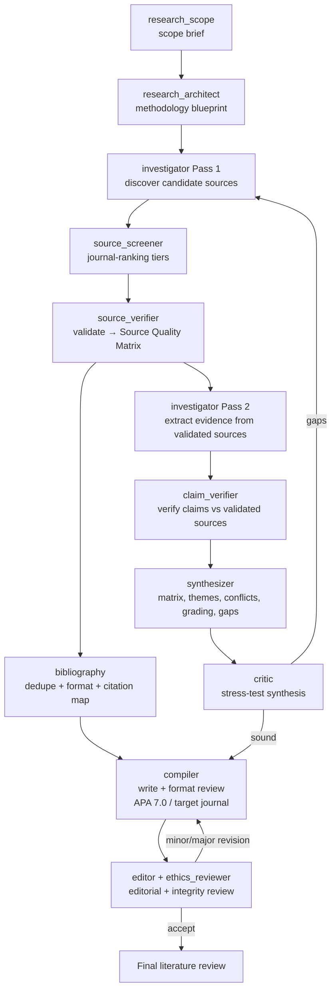

# Deep-Research — Source-Validated Literature Review Engine

Answer a hard question properly and hand back a **written, formatted, integrity-
checked literature review** — not just notes. Scope → design → discover → screen
by journal ranking → validate sources → extract & verify evidence → synthesize →
stress-test → write → review-loop → final report. Original work; architecture
informed by open community food-deep-research skills (see the repo README
Acknowledgements). Usable standalone, or as the deep-dive engine called by
`food-research`.

## Modes
- **quick brief** — scope → discover → screen (Tier 1) → light synthesis → short sourced answer. Skips the full validation/compile/review loop.
- **full** — the default: the complete 12-subagent pipeline below with the iterate-to-saturation and compile↔review loops, ending in a finished review.

## Subagent team (dispatch via the Agent tool)
| # | Subagent | Job |
|---|---|---|
| 1 | `research_scope` | Comprehensive scope brief: background, problem, significance, central + sub-questions, concepts, boundaries, success criteria. |
| 2 | `research_architect` | Methodology blueprint: review type, search strategy, inclusion criteria, analytical framework, reporting standard, stopping criteria. |
| 3 | `investigator` | Pass 1 discover candidate sources; Pass 2 extract evidence **from validated sources only** (parallel per sub-question). |
| 4 | `source_screener` | Prioritize candidates by **journal ranking** (Tier 1 Q1/Q2 + Nature/Science/Cell + other-discipline Q1/Q2; Tier 2 Q3; avoid Tier 4). |
| 5 | `source_verifier` | Validate each prioritized source (existence/DOI, venue legitimacy, retraction, predatory, methodology, COI) → Source Quality Matrix. |
| 6 | `bibliography` | Deduplicate + format references (APA 7.0 default, or target-journal style via `journal-selector`); build the citation map + `.bib/.ris`. |
| 7 | `claim_verifier` | Verify each load-bearing claim against its validated source; classify fact/hypothesis/contested/speculation. |
| 8 | `synthesizer` | Evidence matrix, thematic synthesis, conflict reconciliation, evidence grading, coverage advisory, gap agenda, narrative arc. |
| 9 | `critic` | Devil's advocate on the **synthesis**; loop back to investigate if gaps. |
| 10 | `compiler` | Write & format the **literature-review draft** (APA 7.0 / target journal); cite by key only; no fabrication. |
| 11 | `editor` | Editorial review of the draft (5 weighted dimensions, verdict + prioritized feedback). |
| 12 | `ethics_reviewer` | Integrity/ethics review of the draft (citation integrity, faithful representation, bias, COI, disclosure). |

## Workflow

**Two loops:** (1) *evidence loop* — `critic` sends gaps back to `investigator`
(cap ~2–3); (2) *writing loop* — `editor`/`ethics_reviewer` send revisions back
to `compiler` until Accept (cap ~2–3), then deliver.

## Source discipline (non-negotiable)
- **Investigation and claim-checking operate only on validated sources** — those that passed `source_screener` (ranking) **and** `source_verifier` (validity). Retracted/unresolvable sources are excluded and logged.
- **Journal ranking** favors Tier 1 (Q1/Q2 food-science & nutrition, Nature/Science/Cell families, Q1/Q2 in any other discipline); Tier 2 (Q3) only to fill gaps; Tier 4 avoided.
- Every claim carries a source and locator; inference is labelled as inference.

## Formatting
Default **APA 7.0**. If the user names a **target journal**, `bibliography` and
`compiler` call the **`journal-selector`** skill to format the review to that
journal's structure, limits, and reference style.

## Principles
Every claim sourced; fact separated from interpretation; disagreement shown, not
averaged; uncertainty surfaced. Upstream evidence beats parametric knowledge —
mark missing evidence `[EVIDENCE GAP]`, never fabricate.

## References (load as needed)
- `references/reasoning-and-fallacies.md` — `synthesizer`/`critic`: sound argument + fallacies.
- `food-research/references/literature-sources.md` — databases/APIs for `investigator`.
- `food-research/references/source-quality-hierarchy.md` — evidence grading for `source_verifier`/`synthesizer`.
- `food-research/references/reporting-guidelines.md` — EQUATOR/PRISMA/CONSORT/STROBE.
- `food-paper/references/apa7-quickref.md` — APA 7.0 for `bibliography`/`compiler` (default style).
- `food-review/references/ethics-integrity-checklist.md` — for `ethics_reviewer`.
- `food-paper/references/faithfulness-and-citation.md` — **grounding + four-gate citation check** for `bibliography`, `source_verifier`, `claim_verifier`, `compiler`. Never invent sources/data; run `scripts/verify_citations.py`.
- `food-paper/references/privacy-and-confidentiality.md` — **privacy scan before delivering the report** (no local paths/secrets); `scripts/privacy_scan.py`.

## Handoff
Standalone → deliver the final review. Called by `food-research` → return the
validated synthesis (or the finished review) to fold into the evidence brief.
