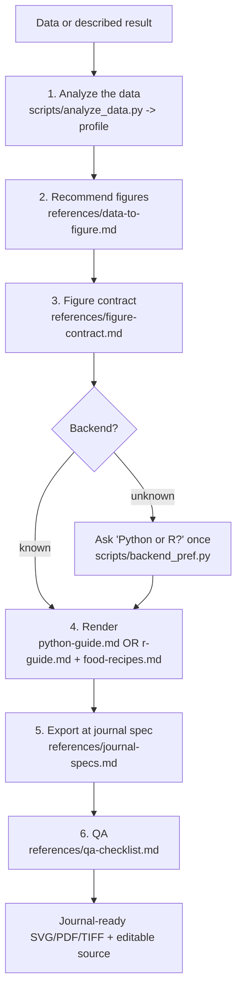

# Food-Figure — Data-Driven Figure System for Food & Nutrition Science

Turn a dataset (or a described result) into the right submission-grade figure.
**The chart serves the scientific logic; polish is subordinate to making the
core conclusion clear, defensible, and reviewable.** Original work; architecture
informed by open community figure skills (see the repo README Acknowledgements).

Load reference files **as needed** (progressive disclosure) — don't read them all
up front. The map is in the frontmatter `references` list.

## Workflow

### 1 — Analyze the data
If the user supplies a data file (CSV/TSV/Excel) or table, profile it first:
run `scripts/analyze_data.py <file>` to get, per column, the type
(numeric/categorical/datetime), cardinality, missingness, distribution summary,
and the detected structure (grouping factors, repeated measures, time/dose axis,
wide sensory/composition matrix). If the user only describes a result, elicit the
same: what varies, what's measured, n, and the error type. See
`references/data-to-figure.md`.

### 2 — Recommend the figure(s)
From the profile, propose the **best** figure type(s) with a one-line rationale
each, and say what each would show. Prefer the figure that makes the paper's
claim most directly; note honest alternatives. The decision rules and a full
catalog are in `references/data-to-figure.md` and `references/chart-types.md`.
Never force a chart the data can't support (e.g. bar-of-means where a
distribution matters → box/violin + points).

### 3 — Figure contract (before code)
Fix the conclusion, evidence logic, export needs (target journal), and review
risks. See `references/figure-contract.md`.

### 4 — Backend gate (blocking)
- **Data figures → Python or R (always).** Resolve the backend by priority:
  explicit request → language of the user's input files/data → saved preference
  (`python scripts/backend_pref.py get`) → ask once ("Python or R? I'll remember
  this") and save it (`backend_pref.py set python|r`). The chosen backend does
  **all** data graphics, preview, and export; the other may only help with data
  prep/conversion.
- **AI image route (opt-in, schematics only).** **Only if the user explicitly
  asks** to generate the image with **Gemini, ChatGPT, or Claude** (or another
  named image model) — and **only for conceptual visuals** (mechanism diagrams,
  graphical abstracts, process schematics) — use that model instead. **Never** use
  an AI image model for a data-bearing figure, and never let it invent data. See
  `references/ai-image-generation.md`.

### 5 — Render & export
Use the selected backend's guide (`python-guide.md` = matplotlib/seaborn/
subplot_mosaic/statsmodels; `r-guide.md` = ggplot2/patchwork/ComplexHeatmap/
ggrepel + svglite/cairo_pdf/ragg) plus `food-recipes.md` for the food/nutrition
figure types. **Start from the template library** — `examples/python_food_figures.py`
or `examples/r_food_figures.R` — which has a ready function for every figure type;
adapt it to the user's data. Export **vector** (PDF/SVG) for line/bar/scatter and
**TIFF (LZW)** at the journal DPI for raster/microscopy; keep an editable source.
Pull DPI, column width, font, and format from the target journal via
`references/journal-specs.md`; if no journal is set, default to 300 dpi, ~90/190 mm
widths, TIFF+PDF, Arial 7–9 pt.

### 6 — QA
Run `references/qa-checklist.md` before delivering (error bars defined + n;
statistics shown consistently; axes honest; colorblind-safe; labels legible at
final size; matches journal spec; every panel cited). **Privacy:** any code or
legend you hand back must use **relative paths**, never local machine paths — scan
with `python3 scripts/privacy_scan.py` (see
`food-paper/references/privacy-and-confidentiality.md`).

## Modes
- **recommend** — analyze data and suggest figures, no rendering yet.
- **make** (default) — full pipeline to a rendered, exported figure.
- **revise / audit** — critique or fix an existing figure against the QA checklist and journal spec.
- **multi-panel** — compose labelled panels (a, b, c) that share a logical thread.

## Scope
Reproducible, code-generated, submission-grade scientific figures for food &
nutrition. Not for dashboards or Illustrator/Figma-first artwork. A
schematic/graphical-abstract (mechanism diagram) is a drawing task: keep it in
Python/R by default, or — only if the user explicitly asks — generate it with an
AI image model (Gemini/ChatGPT/Claude) per `references/ai-image-generation.md`.
Data figures are always Python/R.

## Handoff
Called by `food-paper`'s `viz_designer` at the journal spec; figures feed the
manuscript's Results.
