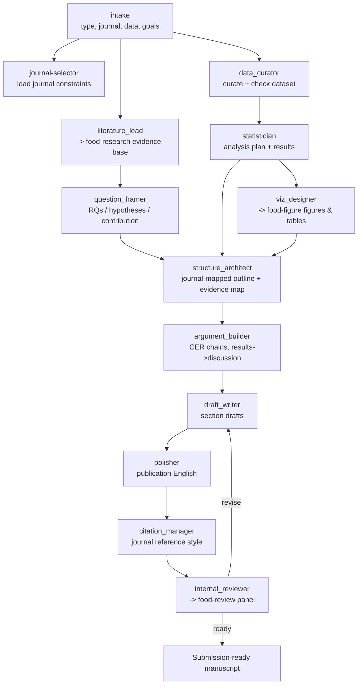

# Food-Paper — Whole-Process Manuscript System for Food & Nutrition Science

Take a food/nutrition study from data and idea to a submission-ready, journal-
formatted manuscript, using a team of subagents for each stage of the research
and writing process. Original work; architecture informed by open community
paper-writing and Nature-style skills (see the repo README Acknowledgements).

## First move — resolve the target journal
Before drafting, call **`journal-selector`** to load the target journal's
structure, limits, and reference style. If none is named, default to **APA 7.0**
and state the assumption. The journal's constraints govern structure, word/
abstract limits, reference style, and the figure spec passed to `food-figure`.

## Modes
- **full** (default) — the whole pipeline: field → questions → data/stats → figures → argument → draft → polish → self-review.
- **plan** — Socratic planning of the paper chapter by chapter (no full draft).
- **outline** — detailed outline + evidence map only.
- **section** — draft or rewrite one section (intro/methods/results/discussion/abstract).
- **stats** — statistical analysis plan/execution guidance only.
- **revise** — revise against an existing review (a `food-review` report and/or margin comments on a Word file). Edit **the original `.docx` with Tracked Changes** (do not start a fresh copy), resolving each comment, and produce a **point-by-point response letter as a new Word document**. See `references/revision-response.md`.
- **format-convert** — convert a draft to the target journal's structure + reference style; output **Markdown, LaTeX (.tex), or DOCX**, and **build a PDF** via Pandoc or `latexmk` (see `references/latex-guide.md`). Yes — this skill can prepare and edit LaTeX drafts.
- **polish** — language editing to publication-quality English.

## Subagent team (dispatch via the Agent tool; independent stages run in parallel)
| # | Subagent | Stage of the research process |
|---|---|---|
| 1 | `intake` | Capture paper type, target journal, data/materials, and goals; set the plan. |
| 2 | `literature_lead` | Understand the field — calls the **`food-research`** skill for the evidence base. |
| 3 | `question_framer` | Research questions / hypotheses / objectives + the contribution. |
| 4 | `data_curator` | Curate the dataset: integrity, units, missing data, metadata, provenance. |
| 5 | `statistician` | Statistical plan + analysis appropriate to the food/nutrition design. |
| 6 | `viz_designer` | Figures & tables — calls the **`food-figure`** skill at the journal spec. |
| 7 | `structure_architect` | Outline mapped to the target journal's structure + evidence map. |
| 8 | `argument_builder` | Claim–evidence–reasoning chains; results→discussion logic. |
| 9 | `draft_writer` | Draft each section with food-science reporting conventions. |
| 10 | `polisher` | Edit to clear, publication-quality scientific English. |
| 11 | `citation_manager` | References + in-text citations in the journal's style (APA 7.0 default). |
| 12 | `internal_reviewer` | Pre-submission self-review — calls the **`food-review`** panel. |

## Workflow

## Food & nutrition reporting defaults (enforced by `draft_writer` / `data_curator` / `statistician`)
Composition as g/100 g (basis + AOAC method); sensory panel type/size/scale +
ethics; microbial counts log CFU/g with LOD; TPA/rheology parameters + settings;
HPLC/GC/LC-MS conditions, LOD/LOQ, recovery, identification by standards/MS-MS;
mean ± SD/SEM with n; the statistical model, test, post-hoc, and threshold, with
significance shown consistently. Reproducible Methods (cultivar/breed/batch,
prep, storage). Ethics/food-safety statements where relevant.

## References (load as needed)
- `references/paper-structure.md` — `structure_architect`: IMRaD/review patterns + abstract types.
- `references/writing-style.md` — `draft_writer`/`polisher`: scientific style, title/intro rhetoric.
- `references/writing-quality-check.md` — self-check before `internal_reviewer`.
- `references/statistics-reporting.md` — `statistician`: what to report and which test.
- `references/declarations-guide.md` — CRediT, funding, COI, data availability, ethics.
- `references/apa7-quickref.md` — default citation style for `citation_manager` (canonical APA 7.0 for the suite).
- `references/faithfulness-and-citation.md` — **grounding rules + four-gate citation check; the suite's no-fabrication contract.** Run `scripts/verify_citations.py` on the reference set.
- `references/latex-guide.md` — prepare/edit LaTeX drafts and build the PDF (Pandoc / latexmk).
- `references/revision-response.md` — **revise mode**: tracked changes on the original Word manuscript + a point-by-point response letter (new `.docx`).
- `references/privacy-and-confidentiality.md` — **privacy check before delivery** (no local paths/secrets); run `scripts/privacy_scan.py`.

## Grounding (non-negotiable)
Write **only** from the user's data and verified literature. Never invent
references, DOIs, numbers, or results; unsupported content is marked
`[UNVERIFIED]`/`[EVIDENCE GAP]`, never filled from memory. `citation_manager` and
`draft_writer` enforce the four-gate citation check in
`references/faithfulness-and-citation.md`.

## Handoffs
`food-research` (evidence in) → **food-paper** → `food-review` (external panel) →
**food-paper** revise. Orchestrated by `food-pipeline`.
