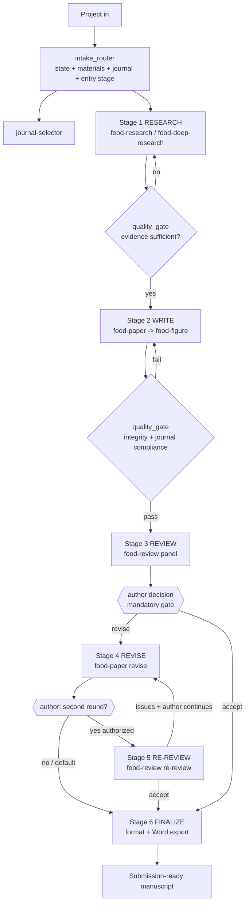

# Food-Pipeline — Master Research-to-Publication Orchestrator

The top-level conductor. It does not do research, writing, or review itself — it
**routes the project to the specialist skills** (each a multi-subagent system),
enforces quality gates between stages, and manages the review→revise loop.
Original work.

## Skills it orchestrates (each brings its own subagent team)
- **`journal-selector`** — target-journal constraints (structure, limits, reference style, figure spec). A **shared procedure, not an installed skill**: load `journal-selector/SKILL.md` and follow it.
- **`food-research`** — literature/evidence synthesis (quick brief / full review / **systematic** PRISMA + OHAT). Use **`food-deep-research`** instead for an open-ended, source-validated deep dive or a standalone literature review.
- **`food-paper`** — whole-process manuscript system (field → questions → data/stats → figures → argument → draft → polish → self-review).
- **`food-figure`** — submission-grade figures at the journal spec (invoked within `food-paper`).
- **`food-review`** — multi-reviewer peer-review panel + formatting compliance.

## Own subagents
- **`intake_router`** — reads the project's current state and materials, resolves the target journal, picks the entry stage, and assembles the context each downstream skill needs.
- **`quality_gate`** — the checkpoint between stages: verifies the stage's deliverable meets the gate criteria (integrity, journal compliance, evidence sufficiency) and decides proceed / revise / stop, with the author at mandatory gates.

## Stages
| Stage | Skill / agent | Deliverable | Gate |
|---|---|---|---|
| 0 · ROUTE | `intake_router` + `journal-selector` | Entry point + journal constraints | — |
| 1 · RESEARCH | `food-research` (or `food-deep-research`) | Evidence brief / gap list / (systematic report) | evidence sufficiency |
| 2 · WRITE | `food-paper` | Draft: analysis, figures (`food-figure`), argument, references | integrity + journal compliance |
| 3 · REVIEW | `food-review` | **Review & Response Report (`.docx`)** — feedback + editorial decision — plus **margin comments** on the manuscript (when Word tooling available) | **mandatory** author decision |
| 4 · REVISE | `food-paper` (revise) | Revision + response entries — **tracked changes on the original Word only if the author authorizes** | issues resolved |
| 5 · RE-REVIEW | `food-review` (re-review) | **Only if the author authorizes a second round** — verifies the revision; may add new comments | accept / stop (no auto third round) |
| 6 · FINALIZE | `food-paper` (format-convert) + `writer` | Submission-ready manuscript (`.docx`) + the one **Review & Response Report** (`.docx`) | final compliance |

## Knowledge reuse — don't research the same field twice
When the pipeline **ran Stage 1** (it entered at Stage 0 or 1), the field has already
been searched and synthesized. Stages **3 · REVIEW** and **5 · RE-REVIEW** must
therefore **carry the Stage-1 evidence base into `food-review`** rather than let its
`knowledge_builder` repeat a full literature search:

- **Pass forward** the Stage-1 output (`food-research` / `food-deep-research`:
  validated sources, evidence matrix / synthesis, grading, gap list) as the review's
  field-knowledge foundation; don't re-fetch what Stage 1 already validated.
- **Top it up** with the **`food-research` `quick brief`** stream to find the field's
  **key review publications** and **read those reviews in full** (state of the art,
  consensus vs contested, standard methods, benchmark ranges).
- **Knowledge base = Stage-1 knowledge + key-review knowledge.** The manuscript's own
  cited sources are still read and audited (Pathway A), reusing Stage-1 records where
  the source was already retrieved.

**If Stage 1 did not run** (entry at Stage 2/3 with a finished draft), there is
nothing to inherit — `food-review` builds its knowledge base the full way
(Pathway A + B). Using **`food-review` standalone is unaffected** by this rule. See
`food-review/agents/knowledge_builder.md`.

## Review & revision defaults (Stage 3 onward) — explicit authorization

**Default: one review→revise round**, then FINALIZE. Do **not** auto-run a second
round or silently rewrite the author's original Word file.

Ask once (consolidate) before Stage 4 when a `.docx` (or equivalent) is in play:

1. **Second review round?** Default **no**. Run Stage 5 (RE-REVIEW) only if the
   author explicitly authorizes it. Hard cap remains **2** rounds total.
2. **Edit the original Word with Tracked Changes?** Default **no**. Only modify
   the original manuscript in place when the author explicitly authorizes it.
   Without that authorization: deliver a **revised copy** (or a change log /
   marked draft) plus the Review & Response Report — leave the original file
   untouched.

## Deliverables — exactly two files, both Word (`.docx`)
The pipeline produces **one manuscript** and **one report**. Never a separate review
report *and* a response letter; never Markdown.

1. **One manuscript file** (`.docx`). Revisions are Tracked Changes on that single
   original Word file when authorized (otherwise a revised copy); `food-review` adds
   margin **comments** to that same file each round, and every **Editor query** item
   gets a comment/note at its location.
2. **One `Review_and_Response_Report_<slug>_<date>.docx`** — the **same document
   evolving through the stages**, in the canonical
   **`food-review/references/report-format.md`** structure (Parts A/B/C; stable issue
   IDs; precise locations; colour legend):
   - **Stage 3 (REVIEW)** — `food-review` writes the reviewer feedback (black): every
     concern with its ID and location, plus the editorial decision.
   - **Stage 4 (REVISE)** — `food-paper` **updates that same file in place**, filling
     each item's `Response (<type>)` (blue) = Tracked edit · Editor query ·
     Recommendation · Residual, with what was actually done and where.
   - **Stage 5 (RE-REVIEW)**, if authorized — append `R2-*` items to the same file.

   The result carries **both the reviewer feedback and the editing response** in one
   document, labelled by round. **Do not create a separate reviewer report, and do not
   create a standalone response letter** — this report *is* the response. (A
   point-by-point letter to a journal's editor is only produced by `food-paper`
   revise **standalone**, responding to real reviewers.)

Markdown is a working format only: convert with Pandoc (`pandoc report.md -o
report.docx`) or the **`docx` skill**, and never claim a `.docx` you did not produce.
Run `scripts/privacy_scan.py` on every file before delivery.

See `food-review/references/report-format.md`,
`food-review/references/word-review-comments.md`, and
`food-paper/references/revision-response.md`.

## Workflow

## Entry points (mid-pipeline)
`intake_router` detects where to start: a topic/dataset → Stage 1; a full draft →
Stage 2 or 3; reviewer comments in hand → Stage 4. It never restarts completed
stages unnecessarily. At Stage 3/4 it records whether the author has authorized
a second round and/or in-place tracked changes on the original Word file.

## References (load as needed)
- `references/mode-advisor.md` — `intake_router` uses it to pick entry stage, research flavor, and skills.
- `references/pipeline-state-machine.md` — states, transitions, entry points, loop caps.
- `references/quality-gates.md` — the per-stage gate criteria `quality_gate` applies.

## Rules
- **Journal first, journal throughout:** re-flow references and re-check limits whenever the target journal changes.
- **Gates are real:** `quality_gate` can send a stage back; integrity and review gates cannot be skipped, and the review decision is always the author's.
- **One round by default:** do not auto-run RE-REVIEW; a second round needs explicit author authorization (hard cap 2).
- **Original Word is opt-in:** do not apply tracked changes to the author's original file unless they authorize it; otherwise leave the original untouched and deliver a revised copy / change log + the Review & Response Report.
- **Food-science standards everywhere:** n and error type, validated methods, panel details, ethics/food-safety — enforced at every write/review gate.
- **Don't duplicate work:** the specialist skills own their subagents; the pipeline sequences and gates them, it does not re-implement them.
- **Two deliverables, both `.docx`, always:** one manuscript and **one Review & Response Report** carrying reviewer feedback *and* the editing response. Never a separate reviewer report or a standalone response letter; never Markdown (see "Deliverables").
