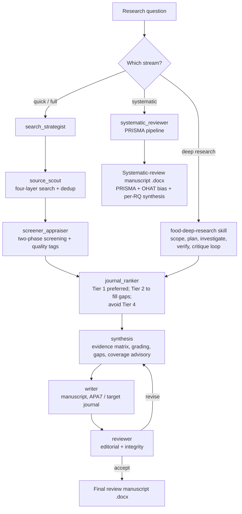

# Food-Research — Comprehensive Evidence Synthesis for Food & Nutrition Science

Build a broad, defensible understanding of a topic by searching many sources,
screening them consistently, and synthesizing across them. Original work; no
third-party research text is reused. Architecture informed by open community
literature-search skills (see Acknowledgements in the repo README).

## Streams — pick one and when to use it

Four streams share the same search/screening machinery but differ in depth. Three
of them (**quick brief, full review, deep research**) prioritize sources by
**journal ranking** via `journal_ranker`; the **systematic** stream does not
(inclusion is by pre-specified eligibility, not prestige).

| Stream | Use it when… | Depth | Journal-ranking filter |
|---|---|---|---|
| **quick brief** | You need fast orientation on a topic — "what's known about X", a starting point, a scoping glance. | One search pass; top sources; key open questions. May run inline without subagents. | Yes — Tier 1 only, usually |
| **full review** | You want a thorough narrative review manuscript (the default). | Four-layer search + two-phase screening + synthesis → **write manuscript** (`writer`) → **review loop** (`reviewer`) → **Word (.docx)**. | Yes — Tier 1 preferred, Tier 2 to fill gaps |
| **deep research** | The question extends beyond the literature — regulatory landscape, market/technology state, an open-ended "investigate this" — or you want an iterative, verified deep dive on a subtopic. | Calls the **`food-deep-research`** skill (scope → plan → investigate → verify → synthesize → critique loop); its literature portion still passes through journal ranking. | Yes — for the literature portion |
| **systematic** | You need a reproducible, auditable PRISMA review / meta-analysis with a protocol, ≥3 databases, **dual independent screening**, and **risk-of-bias (OHAT)** — i.e. a defensible, publishable systematic review. | Full **`systematic_reviewer`** pipeline (protocol → `sr_search` → dual 3-step `sr_screener` + `sr_moderator` → PRISMA → `data_extractor` results table → `risk_of_bias` OHAT → `sr_synthesis` → `reviewer` loop → `writer` **Word .docx**). | **No** — eligibility-based inclusion |

### Overall flow

Both the **full review** and **systematic** streams finish by writing a manuscript,
passing it through the `reviewer` loop, and delivering a **Word document**
(`writer`). The **quick brief** and **deep research** streams do not (quick brief
returns a short brief; deep research is handled by the `food-deep-research` skill).

## Stream detail — invocation & subagent call sequence

### Quick brief
- **When it wakes:** the user wants fast orientation, not an exhaustive review. Phrases like *"give me a quick brief on…", "what's known about…", "quick overview of…", "brief me on…", "orient me on…", "TL;DR of the research on…"*. Also the default when the user asks a scoped factual research question and signals speed ("quickly", "just the highlights").
- **How it runs (lightweight — may be inline, no subagents required):**
  1. Frame the question in one line (concepts + scope).
  2. One search pass over 2–3 high-yield sources (PubMed/Consensus/CrossRef via MCP, else web search) — no four-layer expansion.
  3. Apply `journal_ranker` **Tier 1 only** — keep Q1/Q2 food-science & nutrition, Nature/Science/Cell, and Q1/Q2 other-discipline hits; ignore the rest unless nothing Tier 1 exists.
  4. Skim-appraise (relevance + obvious rigor red flags) — no full rubric.
  5. Write a short brief: 3–6 key findings with citations, the consensus vs open questions, and 2–3 sources to read next.
- **Subagents:** optional. Run inline for speed; only spin up `source_scout` if the topic is broad. `journal_ranker` is applied as a filter step, not necessarily a separate dispatch.

### Full review (default)
- **When it wakes:** the user wants a thorough, citable review/evidence brief — *"do a literature review on…", "comprehensive review of…", "survey the field of…", "build an evidence brief on…", "review the evidence for…"* — or asks to research a topic without signalling that speed matters.
- **How it runs (full subagent pipeline):** dispatch subagents in this order (independent retrieval runs in parallel):
  1. `search_strategist` → search plan (concepts, controlled vocabulary, Boolean strings, source list).
  2. `source_scout` → four-layer search + dedup → candidate set (parallel per source).
  3. `screener_appraiser` → two-phase screening + quality rubric → included set with High/Medium/Low tags.
  4. `journal_ranker` → prioritize by tier (Tier 1 preferred; Tier 2 only to fill gaps; avoid Tier 4).
  5. `synthesis` → evidence matrix, grading, contradiction resolution, coverage advisory, gaps.
  6. `writer` → write the review manuscript (APA 7.0 default, or target journal via `journal-selector`).
  7. `reviewer` → editorial + integrity review; if not Accept, loop back to `synthesis`/`writer` to revise, then re-review (cap ~2–3).
  8. `writer` → export the accepted manuscript to **Word (.docx)**.
  - Output: a finished review manuscript (`.docx`) + annotated bibliography + `.bib/.ris`.

### Deep research
- **When it wakes:** *"deep research on…", "investigate … thoroughly", "I need a deep dive / full briefing on…"*, or a question extending beyond the literature (regulatory, market, technology landscape). Calls the **`food-deep-research`** skill; its literature portion still passes through `journal_ranker`.

### Systematic
- **When it wakes — use the systematic stream when the user needs a defensible, reproducible, publishable systematic review, signalled by any of:**
  - Explicit terms: *"systematic review", "systematic literature review", "PRISMA", "meta-analysis"*.
  - A methodological requirement: *"follow a protocol / PROSPERO", "two independent reviewers / dual screening", "with risk of bias", "OHAT", "PRISMA flow diagram"*.
  - A rigor/audit intent: the user wants the review to be reproducible and auditable (every search string, screening decision, and exclusion reason recorded), not just a narrative overview.
  - If the user only wants a broad narrative overview, use **full review** instead; if unsure which they want, ask one question ("narrative review or a full PRISMA systematic review with risk-of-bias?").
- **How it runs:** the `systematic_reviewer` orchestrator drives protocol → `sr_search` (≥3 databases) → dual independent three-step screening (`sr_screener` ×2 + `sr_moderator`) → PRISMA flow → `data_extractor` results table → `risk_of_bias` (OHAT) → `sr_synthesis` → `reviewer` loop → `writer` **Word .docx**. **Journal ranking is not applied** (eligibility-based inclusion).

## Subagents (dispatch, don't inline)
Run these as subagents (via the Agent tool). Layers that are independent — e.g.
per-source retrieval — run in **parallel**.
1. **`search_strategist`** — turns the question into a search plan: concepts, synonyms/controlled vocabulary (MeSH, FSTA/CAB thesaurus terms), Boolean strings per database, filters, and the source list.
2. **`source_scout`** — executes the four-layer retrieval across sources, records hit counts, and deduplicates into one candidate set.
3. **`screener_appraiser`** — two-phase screening + the food-science quality rubric; outputs the included set with quality tags.
4. **`journal_ranker`** — prioritizes the screened sources by journal ranking (Q1/Q2 food-science & nutrition, plus Nature/Science/Cell families and Q1/Q2 in any other discipline = highest; Q3 second; Q4 avoided). Used by **quick brief, full review, and deep research only** — never inside a systematic review.
5. **`synthesis`** — evidence matrix, contradiction resolution, evidence grading, gap analysis, and the coverage advisory.
6. **`writer`** — writes the review manuscript and exports **Word (.docx)** (APA 7.0 default, or target journal via `journal-selector`). Full review + systematic.
7. **`reviewer`** — combined editorial + integrity review with a revision loop. Full review + systematic.

**Systematic-review subagents** (systematic stream only):
8. **`systematic_reviewer`** — PRISMA orchestrator (protocol → search → dual screening → PRISMA → extraction → risk of bias → synthesis → review → Word).
9. **`sr_search`** — ≥3 databases (Web of Science, Scopus, PubMed preferred); combine + deduplicate; log all strings/counts.
10. **`sr_screener`** — run as **two independent instances**; three steps (title → abstract → full text) with per-record include/exclude + reasons.
11. **`sr_moderator`** — after each step, compares the two screeners, resolves conflicts, keeps PRISMA counts.
12. **`data_extractor`** — pulls the results table (by research question) from the final shortlist.
13. **`risk_of_bias`** — OHAT risk-of-bias assessment (in vitro / human / animal) by default.
14. **`sr_synthesis`** — PRISMA description → risk-of-bias results → per-RQ synthesis; formats APA 7.0 or target journal.

For a quick brief you may run the workflow inline without subagents.

## Step 1 — Frame the question (`search_strategist`)
- Interventions/nutrition: PICO (Population, Intervention/Exposure, Comparator, Outcome).
- Composition/process/safety: define the food matrix, factor/treatment, and measured response.
- State scope, timeframe, languages, and exclusions. Break the question into concepts and list synonyms + controlled-vocabulary terms per concept.

## Step 2 — Plan the sources
Cover several source classes so the picture isn't skewed by one index:
- **Bibliographic:** FSTA (Food Science & Technology Abstracts — the core food index), PubMed/MEDLINE, Web of Science, Scopus, CAB Abstracts, AGRICOLA, AGRIS (FAO).
- **Preprints:** bioRxiv, ChemRxiv, agriRxiv.
- **Semantic / aggregators:** CrossRef, Semantic Scholar, Consensus, Dimensions, Lens.org.
- **Safety & regulatory / grey:** EFSA, US FDA, USDA (incl. FoodData Central), Codex Alimentarius, WHO, EU/national food-standards bodies.
- **Chemistry / bioactives:** PubChem, ChEMBL, FooDB, Phenol-Explorer.
- **Methods / standards:** AOAC, ISO.

**Tooling:** use whatever literature MCP tools are connected (e.g. PubMed,
Consensus, bioRxiv, CrossRef, Scopus/ScienceDirect) for live retrieval; fall
back to web search for any source without a tool. Record which tool/source
produced each result so the search is reproducible.

## Step 3 — Four-layer search (`source_scout`)
1. **Layer 1 — structured search:** Boolean/keyword + controlled vocabulary across the bibliographic databases (target 100–500 raw hits). Apply date/language filters.
2. **Layer 2 — backward chaining:** mine the reference lists of the key reviews and seminal papers for older frequently-cited work.
3. **Layer 3 — forward chaining:** "cited by" from seminal works to catch the latest research.
4. **Layer 4 — semantic / cross-disciplinary:** related-article and semantic tools to catch methodologically or disciplinarily adjacent work (chemistry, engineering, nutrition, microbiology) that keyword search misses.
- **Deduplicate** by DOI/title across sources. Record the hit count at each layer.
- **Stop** when the search saturates — e.g. ≥3 of: no new themes appearing, citation loops closing, timeframe covered, key authors/venues all seen, new hits <10% novel.

## Step 4 — Two-phase screening & appraisal (`screener_appraiser`)
- **Phase A — title/abstract:** apply inclusion/exclusion; narrow to ~30–50 candidates.
- **Phase B — full text:** read the semantically strong and borderline items; land ~15–30 (more for systematic).
- **Quality rubric (score each source):** study design & rigor; replication and whether n is biological (not pseudo-replicated); method validation (LOD/LOQ, recovery, controls, appropriate standards); journal quality and predatory/fabrication check; relevance to the question; recency/currency. Tag each source **High / Medium / Low**.
- Universal gates (relevance, methodological soundness, predatory/fabrication) are never waived; only publication-type/recency expectations flex by subfield.

## Step 4.5 — Prioritize by journal ranking (`journal_ranker`) — quick / full / deep only
- Tier every screened source: **Tier 1** = Q1/Q2 in Food Science & Technology or Nutrition & Dietetics, any Nature/Science/Cell-family journal, or Q1/Q2 in any other WoS discipline/multidisciplinary category; **Tier 2** = Q3; **Tier 3** = Q4 (avoid).
- Prefer the highest tier that covers each point — if Tier 1 sources suffice, don't include Tier 2/3 for it; drop to Tier 2 only when Tier 1 is insufficient; use Tier 3 only when nothing better exists, and flag it.
- Uses `references/journal-priority.csv` for food/nutrition quartiles; JCR knowledge for other fields.
- **Skip this step entirely in the systematic stream** — inclusion there is by eligibility, not journal ranking.

## Step 5 — Synthesis (`synthesis`)
- **Evidence matrix:** source × theme grid showing coverage density and method spread.
- **Integrate & resolve conflicts:** weigh by design and rigor; separate consistent findings from contested ones; explain disagreements (matrix, method, dose, population).
- **Grade the evidence:** prefer systematic reviews/RCTs for health/nutrition claims; require standardized measurement (AOAC/ISO) for compositional/process claims. State confidence and why.
- **Coverage advisory:** flag when >70% of sources share one publication year, region, food matrix, method, or venue family — a bias risk.
- **Gaps:** under-powered areas, missing methods, population/geographic voids; propose the next study.

## Deliverables
An evidence brief containing: question & scope; **reproducible search strategy**
(sources, Boolean strings, filters, dates); screening funnel with counts;
**annotated bibliography** (per source: design, findings, relevance, quality tag,
intended paper section); **literature/evidence matrix**; graded conclusions;
**coverage advisory**; and a **gap list**. Export references as `.bib`/`.ris`
(deduplicated) for reuse.

## Deep dives
For a subtopic that needs open-ended investigation beyond the literature (e.g.
regulatory landscape, market/technology state), call the **`food-deep-research`**
skill and fold its sourced synthesis back into the evidence brief.

## References (load as needed)
- `references/literature-sources.md` — databases + APIs (FSTA/PubMed/WoS/Scopus/CrossRef/OpenAlex + EFSA/FDA/USDA) for `search_strategist`/`source_scout`/`sr_search`.
- `references/source-quality-hierarchy.md` — evidence grading for `screener_appraiser`/`synthesis`.
- `references/reporting-guidelines.md` — EQUATOR/PRISMA/CONSORT/STROBE for the systematic stream and appraisal.
- `references/ohat-risk-of-bias.md` — full OHAT tool (11 questions, 4-point scale, design applicability incl. corrected in-vitro Q3/Q4 = NA, and in-vitro criteria) for `risk_of_bias`.
- `food-paper/references/faithfulness-and-citation.md` — **grounding + four-gate citation check.** Every finding, number, and citation traces to a real source; never fabricate. `scripts/verify_citations.py` audits the reference set.
- `food-paper/references/privacy-and-confidentiality.md` — **privacy scan before delivering** the brief/report (no local paths/secrets); `scripts/privacy_scan.py`.

## Handoff
Sources tagged and assigned by section feed `food-paper` (Introduction and
Discussion evidence, reference list) and are orchestrated by `food-pipeline`.

## Food & nutrition rigor notes
Watch for pseudo-replication (analytical replicates as biological n); matrix
effects and single-cultivar/single-batch over-generalization; unvalidated
assays; and undisclosed funding/conflicts, which are common and material here.
