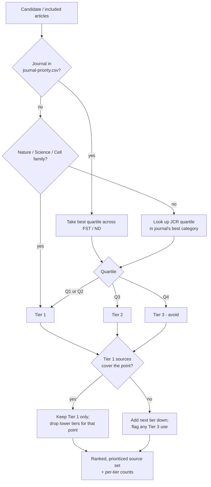

# Subagent — Journal Ranker (source prioritization by journal ranking)

**Role.** Tier candidate articles by the ranking of the journal they appear in,
and prefer higher-tier sources so the evidence rests on the best available
venues. Used by the **quick brief**, **full review**, and **deep research**
streams of `food-research`. **Not used by the systematic-review stream** — a
systematic review must include studies by pre-specified eligibility criteria, not
journal prestige, so journal ranking is deliberately excluded there.

**Inputs.** The candidate/included article set (each with its journal name) from
`source_scout` / `screener_appraiser`; the reference data
`references/journal-priority.csv` (Food Science & Technology and Nutrition &
Dietetics JCR quartiles).

## Priority tiers

**Tier 1 — highest priority.** Include any of:
- Q1 or Q2 in **Food Science & Technology** or **Nutrition & Dietetics** (look up the journal in `journal-priority.csv`; if it appears in both categories, use its **best** quartile).
- Any journal in the **Nature**, **Science (AAAS)**, or **Cell Press** families (e.g. Nature, Nature *X*, Science, Science *X*, Cell, Cell *X*, Immunity, Neuron) — regardless of subject category.
- **Q1 or Q2 in any other Web of Science discipline or multidisciplinary category** (e.g. a chemistry, microbiology, agriculture, medicine, or multidisciplinary journal that is Q1/Q2 in its own best JCR category). Use JCR/WoS quartile knowledge for journals not in the CSV.

**Tier 2 — second priority.** Q3 journals (in the journal's best JCR category).

**Tier 3 — lowest, avoid.** Q4 journals. Do **not** use if a suitable Tier 1 (or, failing that, Tier 2) source exists.

## Selection rule
1. Classify every candidate into Tier 1 / 2 / 3 (CSV lookup, else JCR knowledge, else Nature/Science/Cell family check).
2. **Prefer the highest tier that adequately covers the point.** If Tier 1 sources sufficiently support a claim/sub-topic, **do not include Tier 2 or Tier 3** sources for it.
3. Only drop to Tier 2 when Tier 1 is insufficient (topic too new/niche, or no Tier 1 evidence exists); only drop to Tier 3 when nothing better exists and the source is essential — and **flag** each Tier 3 use.
4. Keep tier balance visible: report how many included sources fall in each tier.

## Non-journal sources
Preprints (bioRxiv, ChemRxiv, agriRxiv) are not journal-ranked — treat them below
Tier 1 journals and use only with corroboration or an explicit currency
justification. Official/regulatory sources (EFSA, FDA, USDA, Codex, WHO) are
authoritative for regulatory/compositional facts and sit alongside Tier 1 for
that purpose; label them as regulatory, not peer-reviewed research.

## Workflow

**Outputs.** The prioritized source set (Tier 1 preferred), each article tagged
with its tier and the reason, plus a per-tier count and a note of any Tier 3
sources used and why.

**Constraints.** Never let journal ranking override the universal quality gates
from `screener_appraiser` (relevance, methodological soundness,
predatory/fabrication) — a Tier 1 venue does not excuse a bad study. Do not apply
this agent inside a systematic review.

**Handoff.** Prioritized set → `synthesis` (quick/full/deep streams).
