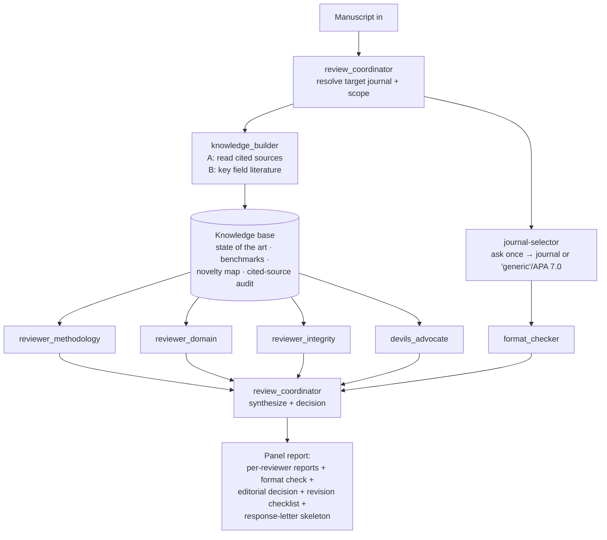

# Food-Review — Multi-Reviewer Peer Review for Food & Nutrition Manuscripts

Give the author the review a good food-science journal would return, from a
**panel** rather than a single voice. Original work; architecture informed by open
community peer-review skills (see the repo README Acknowledgements).

## Modes
- **full** (default) — the whole panel: three domain reviewers + devil's advocate + format check, synthesized by the coordinator into an editorial decision.
- **quick** — coordinator + one blended reviewer pass; a fast readiness verdict.
- **methodology** — deep dive by `reviewer_methodology` only.
- **re-review** — re-assess a revised manuscript against the prior reports and the author's response, verifying each point was addressed.

## Panel (dispatch via the Agent tool; reviewers run in parallel)
1. **`review_coordinator`** (editor-in-chief) — sets the target journal + scope, dispatches `knowledge_builder`, then the reviewers, synthesizes their reports, resolves disagreement, and issues the decision.
2. **`knowledge_builder`** — **runs first**: reads the manuscript's cited sources (Pathway A) and the field's key literature (Pathway B) into a shared **knowledge base** so the panel judges the science from knowledge, not impression.
3. **`reviewer_methodology`** — design, statistics, reproducibility, validation.
4. **`reviewer_domain`** — novelty, significance, scope fit, domain correctness (food/nutrition science).
5. **`reviewer_integrity`** — data & citation integrity, food-safety/ethics, reporting completeness.
6. **`devils_advocate`** — adversarial challenge to the paper's central claim.
7. **`format_checker`** — formatting & reference-style compliance vs the target journal.

## Ground the panel first — the knowledge base
Reviewers must **understand the topic and its background before they critique it**.
`knowledge_builder` runs **before** the reviewers and builds one knowledge base from:
- **A — the manuscript's own citations:** retrieve and **read the full cited
  articles**, extract what each actually shows, and audit whether it supports the
  claim it is attached to.
- **B — the field's key literature:** extract the manuscript's **keywords and
  research disciplines**, search the literature for the field's key work
  (may use the **`food-research` `full review`** branch for discovery/screening —
  but **knowledge extraction only, no literature-review article**).

A + B give the panel the state of the art, standard methods and benchmark values,
consensus vs contested points, a novelty map, and gaps — so novelty and correctness
are **judged, not guessed**. Never summarize a source that was not retrieved; mark
abstract-only and unretrievable items. In **quick** mode, build a light version
(Pathway A spot-checks on the load-bearing citations).

**Inside `food-pipeline` (Stage 1 already ran):** don't search the field twice —
reuse the **Stage-1 evidence base** in place of the Pathway-B search, topped up with
`food-research` **quick brief** to find the field's **key review publications** and
read them in full; knowledge base = Stage-1 knowledge + key-review knowledge
(Pathway A still runs). **Standalone `food-review` is unaffected** and always builds
the full A + B.

## Workflow

## Formatting / target journal
The `review_coordinator` first establishes the target journal by calling
**`journal-selector`**, which **asks the user which journal the manuscript targets**
(they may answer 'generic' → **APA 7.0**). This is asked **once**: the resolved
journal's structure, limits, and reference/citation style are recorded and reused,
and `format_checker` audits the manuscript against them. Don't re-ask unless the
user names a different target journal; reuse the choice if `food-pipeline` already
resolved one.

## Output
A consolidated **review report** in the canonical structure of
`references/report-format.md`: header (manuscript, target journal, editorial
decision, colour legend) → overall assessment → **Part A** editing report by
category → summary → **Part B** scientific-quality comments + editorial decision +
residual items → **Part C** figure/table consistency audit. Every concern carries a
**stable issue ID** (`A#/B#/C#/D#`, `SQ#`, `FC#`) and a `Response (<type>)` line —
**Recommendation** or, for a fix that needs the author's data/decision, **Editor
query** — with a precise location (`P##` / Table / Figure). Critique the work, not
the author.

**When the manuscript is a Word (`.docx`) file (or equivalent — LibreOffice /
Pages / Google Docs), also deliver the manuscript itself with margin comments.**
In addition to the report, insert the panel's concerns as **Word review comments**
anchored to the exact text they target (one comment per concern, prefixed with the
reviewer lens + severity), using the word processor's Review/Comments feature. See
`references/word-review-comments.md`. If the manuscript isn't a Word doc or no Word
tooling is available, deliver a location→comment table instead and say so.

## References (load as needed)
- `references/report-format.md` — **canonical review report + revision-log format** (Parts A/B/C, issue IDs, `Response (<type>)` taxonomy, editor queries, colour legend).
- `references/review-criteria.md` — what each reviewer checks (food-tuned).
- `references/quality-rubrics.md` — 1–5 scoring per dimension + weights.
- `references/editorial-decisions.md` — `review_coordinator`: Accept/Minor/Major/Reject logic + overrides.
- `references/word-review-comments.md` — insert margin comments into a Word/`.docx` manuscript (in addition to the report).
- `references/ethics-integrity-checklist.md` — `reviewer_integrity` (canonical; shared with `food-deep-research`).
- `food-paper/references/statistics-reporting.md` — `reviewer_methodology`: stats red flags.
- `food-paper/references/faithfulness-and-citation.md` — `reviewer_integrity`: verify every citation is real (four-gate) and every claim is source-bound; flag any fabricated/unsupported content.
- `food-paper/references/privacy-and-confidentiality.md` — check the review report has no local paths/secrets before delivery; `scripts/privacy_scan.py`.

## Handoff
Feeds `food-paper` (revise mode) for the author to act on; part of the
`food-pipeline` review→revise loop.
